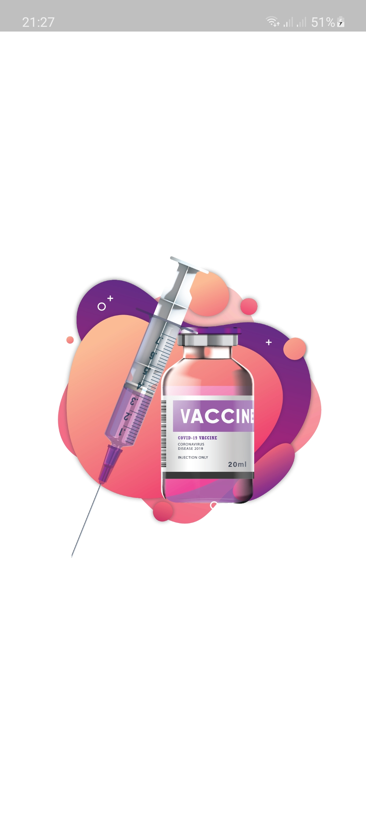
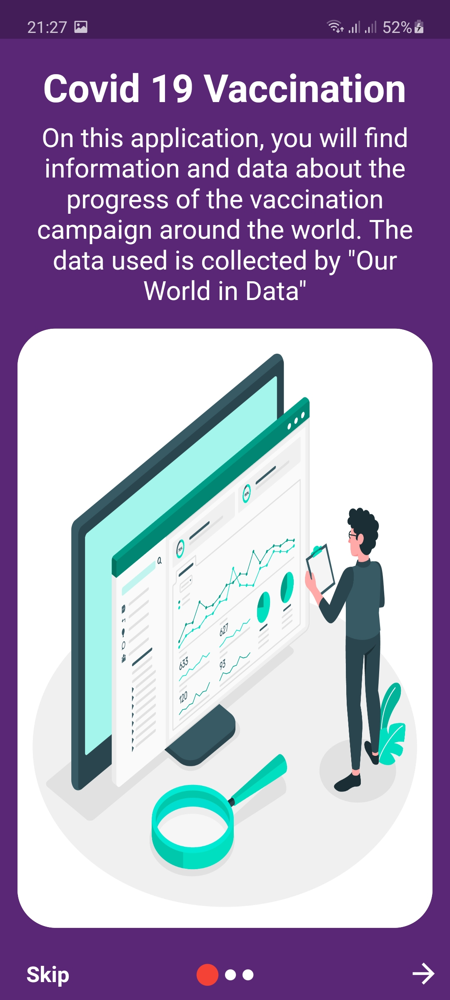
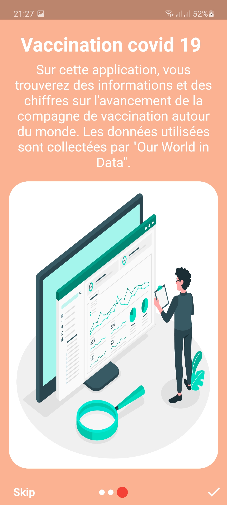
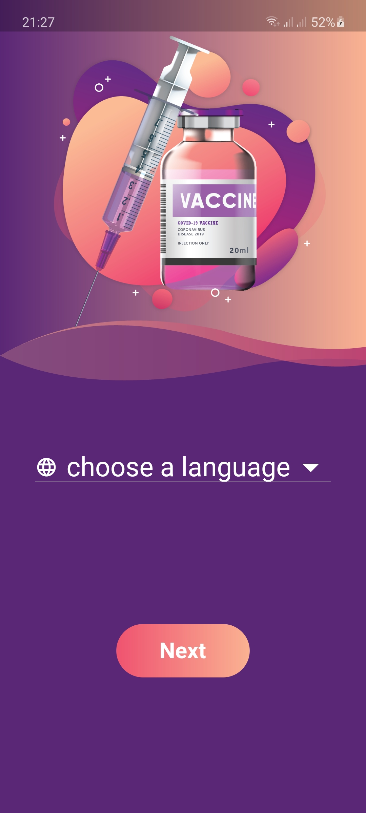
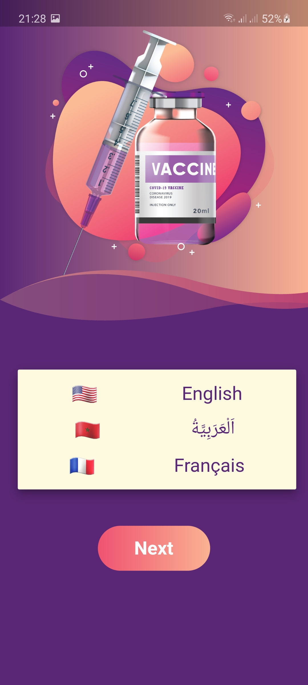
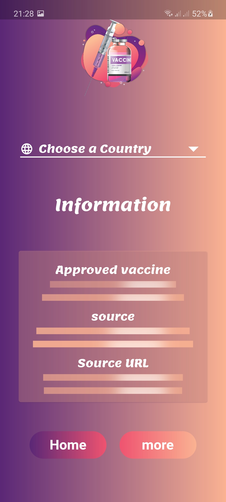
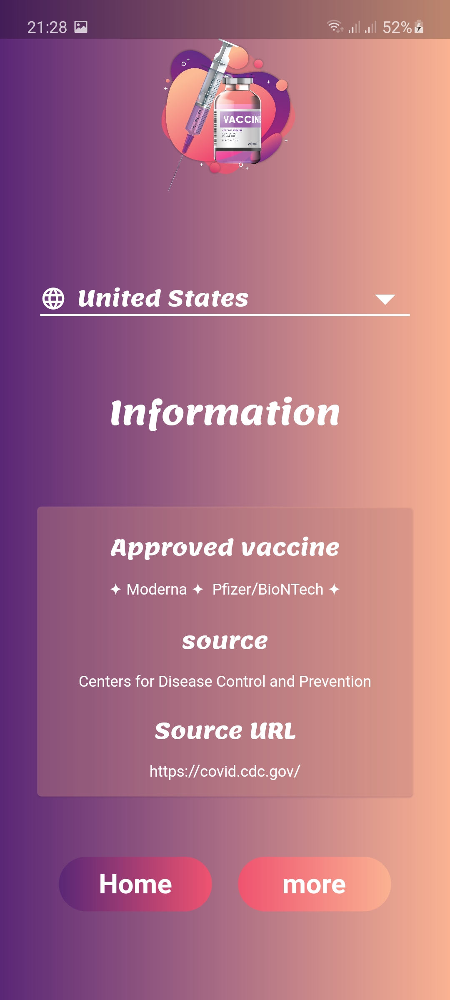

# covidvax

An app showing information and data about the progress of Covid-19 vaccination campaign around the world.

## Packages Used

- Shared preferences(https://pub.dev/packages/shared_preferences)
- csv(https://pub.dev/packages/csv)
- http(https://pub.dev/packages/http)
- flutter_placeholder_textlines(https://pub.dev/packages/flutter_placeholder_textlines)
- sqflite(https://pub.dev/packages/sqflite)
- path(https://pub.dev/packages/path)
- fl_chart(https://pub.dev/packages/fl_chart)
- url_launcher(https://pub.dev/packages/url_launcher)
- flutter_swiper(https://pub.dev/packages/flutter_swiper)
- nima(https://pub.dev/packages/nima)
- google_fonts(https://pub.dev/packages/google_fonts)
- flutter_launcher_icons(https://pub.dev/packages/flutter_launcher_icons)

## Credits

- [Our World in Data](https://ourworldindata.org)
- coolvector / [Freepik](http://www.freepik.com).
- macrovector / [Freepik](http://www.freepik.com).
- slidesgo / [Freepik](http://www.freepik.com).
- freepik / [Freepik](http://www.freepik.com).

## Application UI

### Splash page

### Landing pages

### Home Page

### Choosing Country Page

### Chart Page

